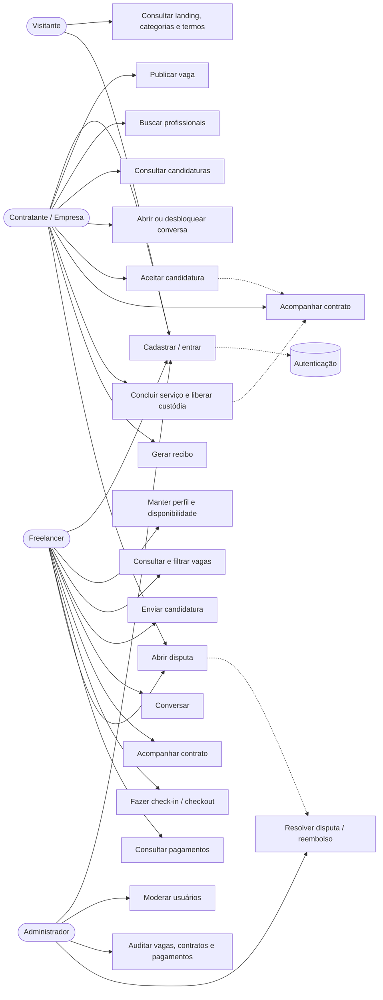
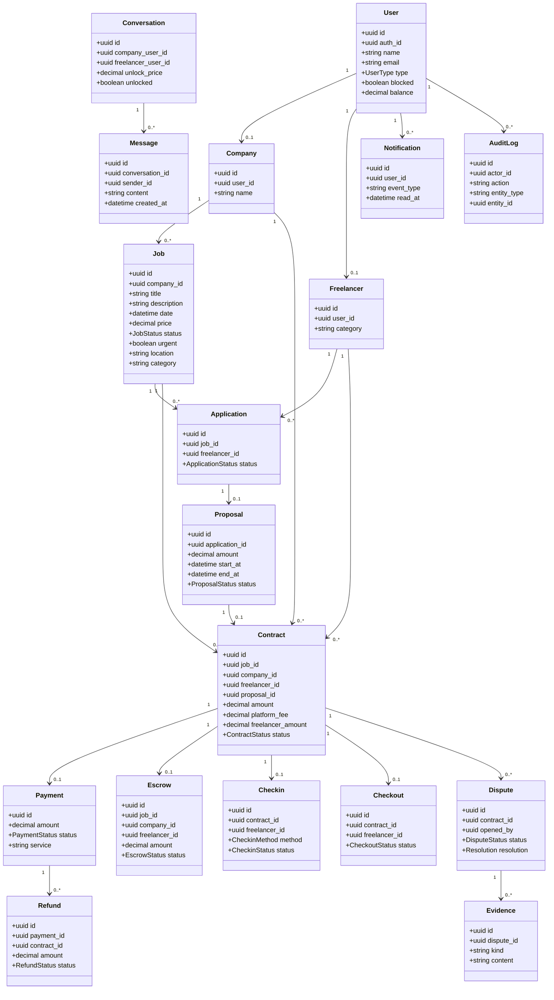
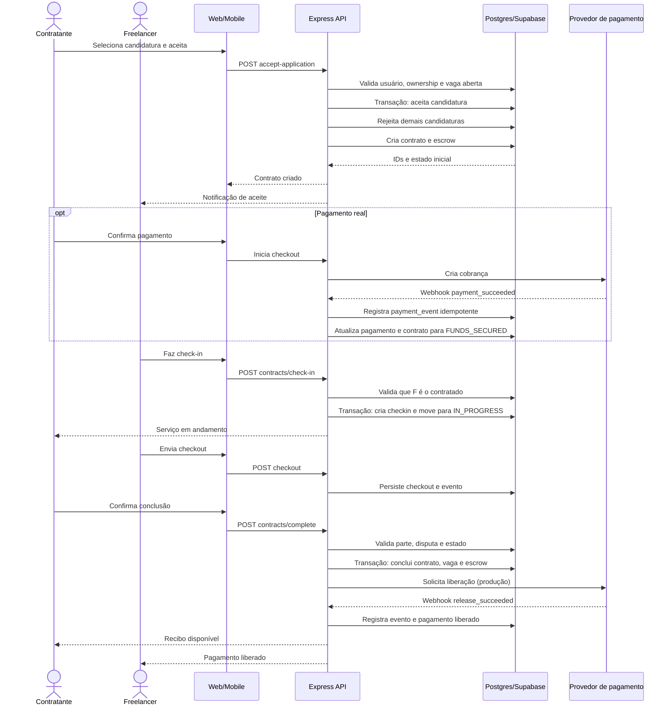
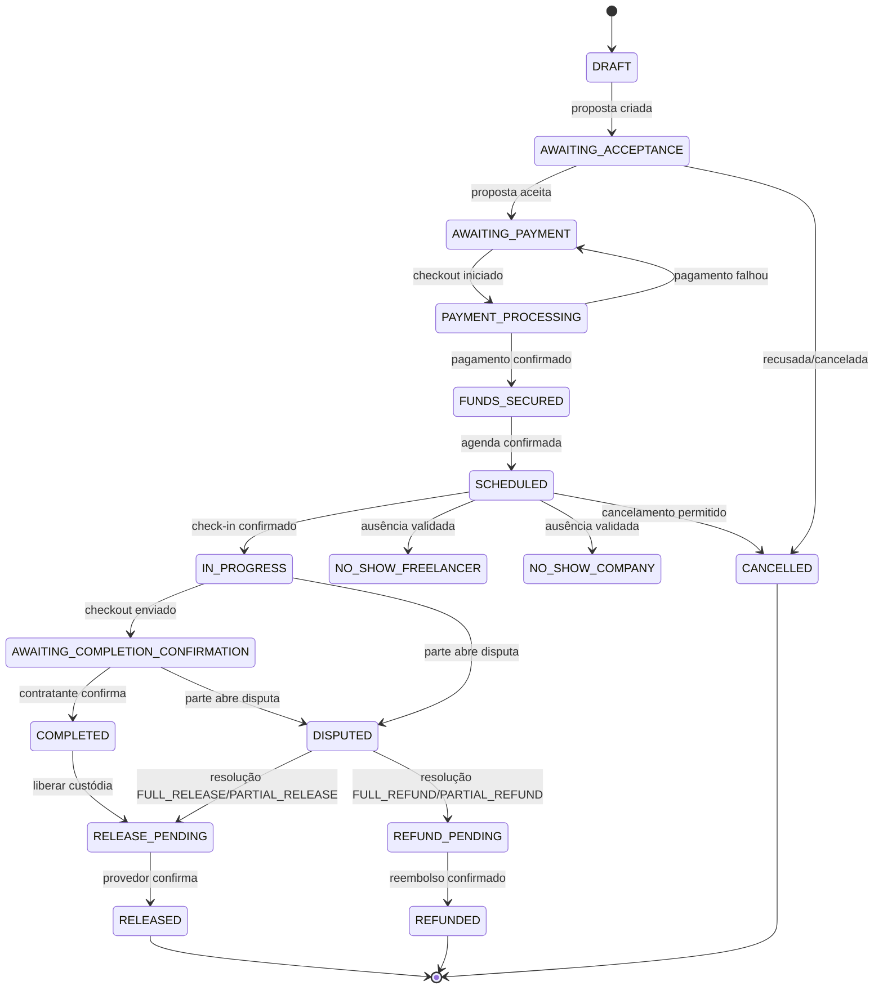
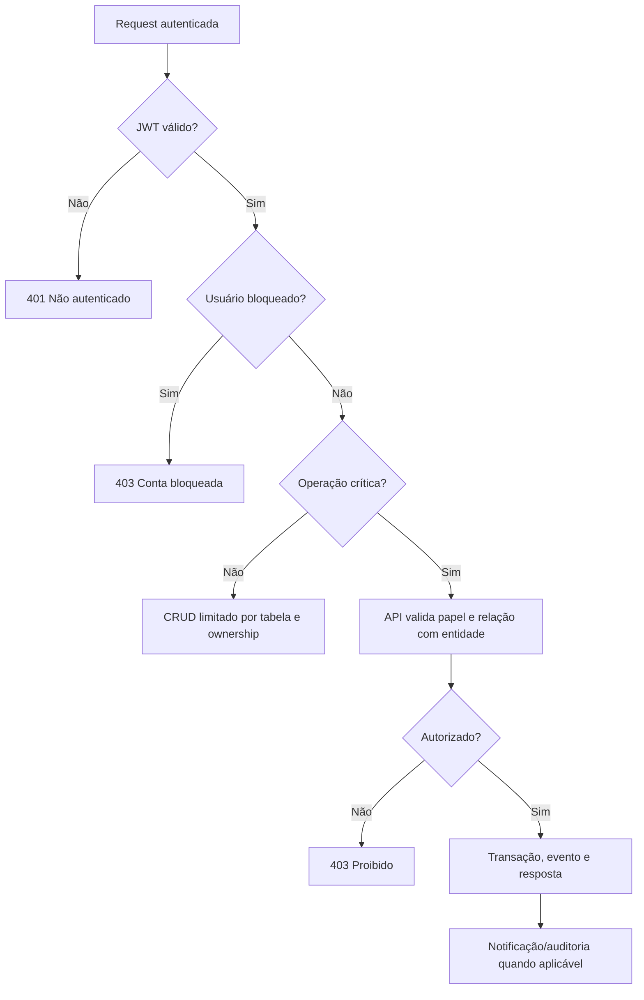

# UML — Trampô

Os diagramas abaixo descrevem a arquitetura funcional e o modelo de domínio observados no código e nas migrações. Eles usam Mermaid e podem ser renderizados no GitHub, GitLab, Mermaid Live ou em ferramentas compatíveis.

## 1. Diagrama de casos de uso

## 2. Diagrama de classes / entidades

## 3. Sequência — aceite, execução e liberação

## 4. Máquina de estados do contrato

## 5. Fluxo de autorização

